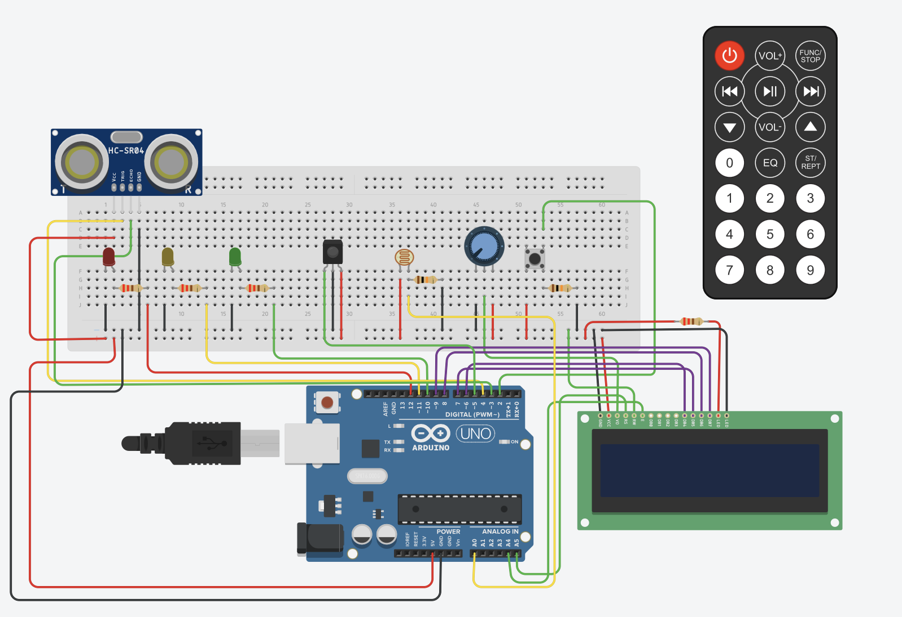

# Final Project - Obstacle Detection System

## Components
- Arduino Uno
- Ultrasonic sensor (HC-SR04)
- LCD screen (16x2)
- IR remote + receiver
- Photoresistor
- Push button
- 3x LEDs (warning, error, light)

## Features
- Auto-locks when obstacle detected closer than 10cm
- Warning LED blinks faster as obstacle approaches
- IR remote controls: unlock, distance unit toggle, screen navigation, settings reset
- Brightness adjusts automatically based on ambient light
- Distance unit (cm/in) persisted across reboots via EEPROM

## Files
- `main.ino` - Full project code
- `circuit.png` - Wiring diagram

## Circuit

